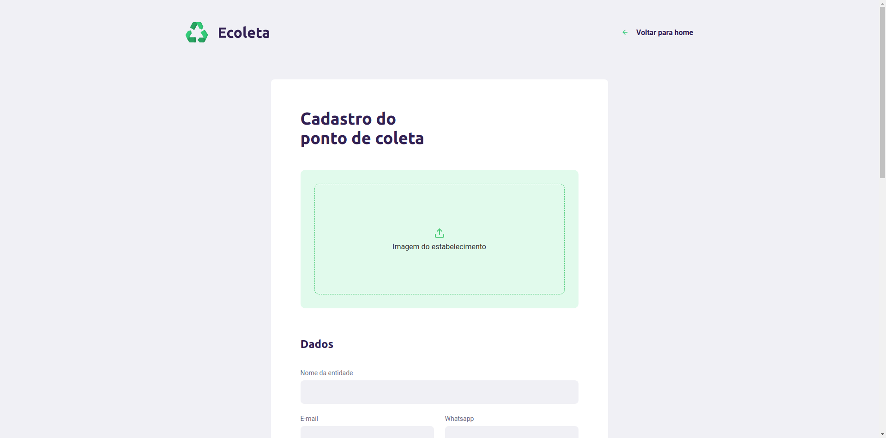

# Next Level Weeks - Rocketseat!

This is the repository of my next level weeks of Rocketseat developing softwares in Node.js, ReactJS and React Native.

<p>
   
   
   
</p>

# NLW Return - <span>Widget</span>

Feedback widget for web and mobile with screenshot!

react react-native express prisma

Web


Mobile


# NLW 4 React - <span>Move.it</span>

Stretching exercices while coding!

Web React Next.js


## Getting Started

Open the project folder

```console
cd nlw4/nextmoveit
```

Install dependencies

```console
yarn
```

Start the app

```console
yarn dev
```

#### Built With

- [React JS](https://reactjs.org/)
- [Next.js](https://nextjs.org/)

# NLW 2 - Proffy

Find avalable teachers ou become a teacher!

Web


Mobile


# NLW 1 - Ecoleta

Marketplace to find places collection points.





## Getting Started for NLW 1 and 2

You will need <a href="https://nodejs.org/en/download/package-manager/" target="_blank">NodeJS</a>, <a href="https://yarnpkg.com/en/docs/getting-started" target="_blank">Yarn</a> or Npm.

<!-- <a href="https://www.docker.com/get-started" target="_blank">Docker</a>. -->

#### NodeJS Backend

```console
yarn
yarn dev

```

#### ReactJS Frontend

```console
yarn
yarn start
```

#### React Native Mobile

First install Expo from Play Store. Open the app.

```console
yarn
yarn start
```

With your mobile connected with usb, scan the QR Code to build.

#### Optionals

1. Rest API Client to requests to backend - <a href="https://insomnia.rest/" target="_blank">Insomnia</a> or <a href="https://www.getpostman.com/" target="_blank">Postman</a>.

#### Built With

- [NodeJS](https://nodejs.org/en/)
- [React Native](https://facebook.github.io/react-native/)
- [React Navigation](https://reactnavigation.org/)
- [React JS](https://reactjs.org/)
- [Axios](https://github.com/axios/axios)
- [Expo](https://expo.io/)

<!-- - [Reactotron](https://infinite.red/reactotron) - Inspector
- [Styled-Components](https://www.styled-components.com/) - Styles
- [Redux](https://redux.js.org/) - React State Manager
- [ESlint](https://eslint.org/) - Linter
- [Redux-Sagas](https://redux-saga.js.org/) - Side-Effect model for Redux
- [PropTypes](https://github.com/facebook/prop-types)
- [Docker](https://www.docker.com/)
- [PostgreSQL](https://www.postgresql.org/)
- [Redis](https://redis.io/)
- [React Native Gesture Handler](https://kmagiera.github.io/react-native-gesture-handler/) -->

## What's next

- NLW 5

---

:wave: [Get in touch!](https://www.linkedin.com/in/eduardo-quintino/)

## License

This project is licensed under the MIT License
